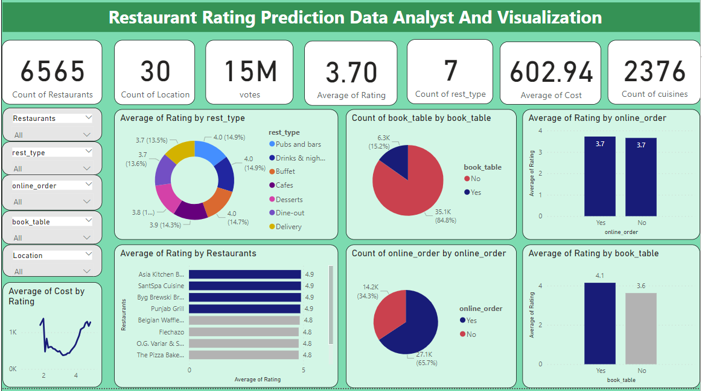
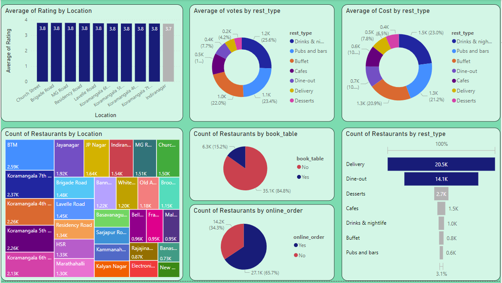
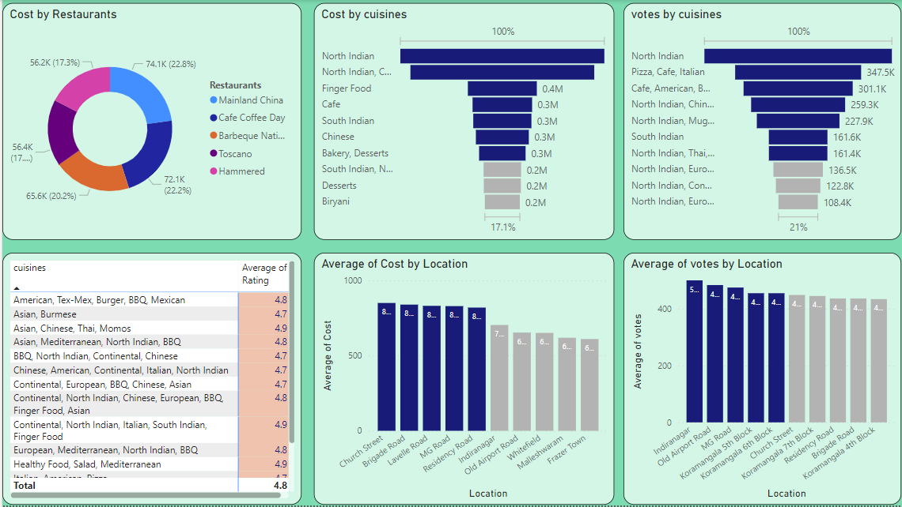

# Restaurants-Analysis-And-Visualization

---
This project aims to perform an analysis of restaurant data from Zomato and build a predictive model to forecast certain aspects related to restaurant performance. Here's an outline of what the project involves:

- Data Collection: Gather data from Zomato's restaurant database. This could include information such as restaurant names, locations, cuisines, ratings, reviews, and more.

- Data Cleaning and Preprocessing: Clean the collected data to remove any inconsistencies, missing values, or errors. Preprocess the data to make it suitable for analysis and modeling.

- Exploratory Data Analysis (EDA): Perform an in-depth exploration of the data to uncover patterns, trends, and insights. This may involve visualizations, statistical analysis, and summarization of key features.

- Feature Engineering: Create new features or transform existing ones to improve the predictive power of the model. This could include extracting information from text fields, encoding categorical variables, or scaling numerical features.

- Model Building: Develop machine learning models to predict various aspects of restaurant performance. This could include predicting ratings, popularity, customer satisfaction, or other relevant metrics. Popular models such as linear regression, decision trees, random forests, or neural networks may be used.

- Model Evaluation: Evaluate the performance of the trained models using appropriate metrics. This may involve splitting the data into training and testing sets, cross-validation, and comparing different models to select the best one.

- Prediction: Apply the trained model to make predictions on new or unseen data. This could help restaurant owners or Zomato itself make informed decisions about marketing strategies, menu changes, or location expansion.

- Visualization and Reporting: Visualize the results of the analysis and predictions using graphs, charts, and other visual aids. Summarize the findings in a comprehensive report or presentation.

Throughout the project, Python programming language and various libraries such as Pandas, NumPy, Matplotlib, Seaborn, and Scikit-learn may be used for data manipulation, analysis, visualization, and modeling. Additionally, tools like Jupyter Notebook and PyCharm may be employed for code development and execution.

## Tools Used
### Python Programming Language
### Dashboard: Power BI
### Libraries Used 
> - NumPy
> - Pandas
> - Scikit-learn
> - Seaborn
> - Matplotlib
> - Time
> - Datetime
---
Datasets Link: <*https://www.kaggle.com/code/shivan118/zomato-restaurants-analysis/input*>
***
### Author
> TranTrucVy: 
<*https://github.com/TranTrucVy*>